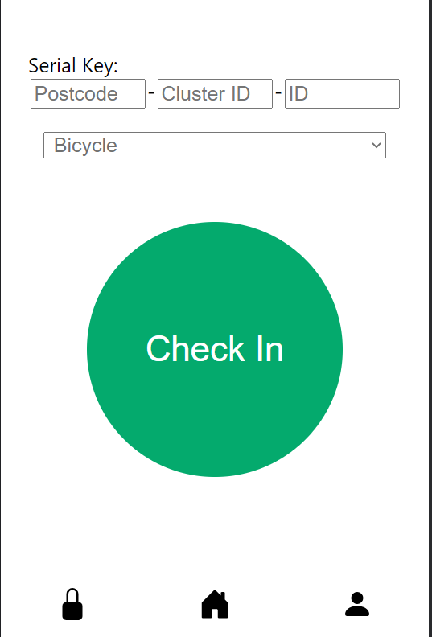

# Webpage
This is the webpage app for Imperial College's Embedded System CW1. 

## Usage
Node.js is required to be installed for running the script. (https://nodejs.org/en/download/). Dependencies of the script can installed by `npm install` <br>

Running the script: <br>
```
npm start
```
A webpage would be hosted on `http://localhost:3000/`. This is currently still in development mode. In the final product, separately starting up of the React dev Server would not be needed. 

## Map / Home Page
The webpage would show a map of the surrounding of the user's location with markers on bicycle lock clusters. A green pin indicates availability while a red pin indicates that all locks are used. <br/>

<br/>
Upon clicking onto the pin, details about the lock would be shown, including name, total locks and available locks. <br/>

<br/>

## Check In / Check Out Page
The check in page has a text box for user to fill in the Serial Key number and a button to submit check in request. When the system detects the user had checked into a lock, the webpage would be displaying a red button to prompt user to check out instead. <br/>

<br/>

## Register Page
Allow users to register into the system by filling in information such as full name, username, email address and passward.

<br/>

## Menu Bar
The footer is a menu bar that allows user to jump to different page. The lock icon refers to the Check In Page, the home icon refers to the home page and the person icon refers to the register page.

## Change Log
27-Jan-2022 : initial commit <br/>
08-Feb-2022 : added map page <br/>
12-Feb-2022 : added check in out + register page. added router.