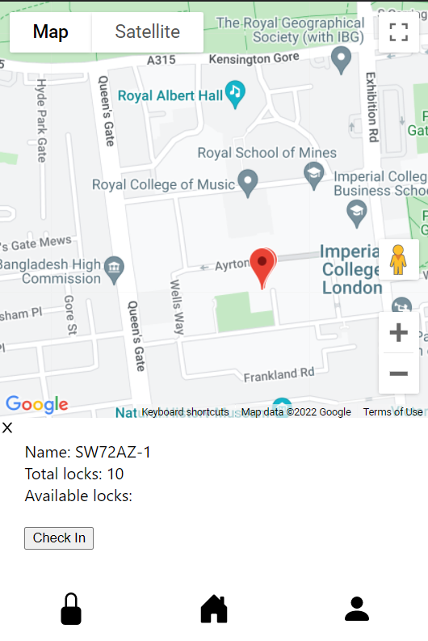
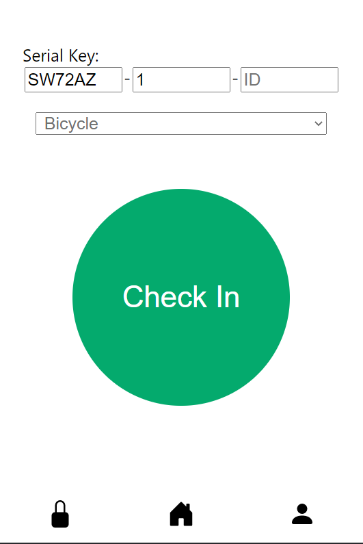
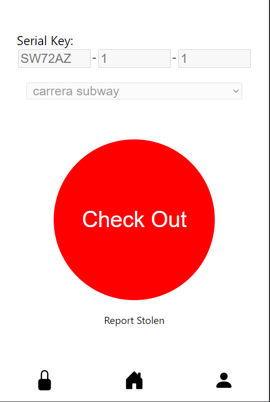
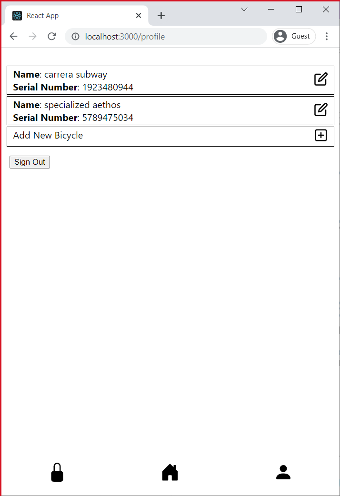
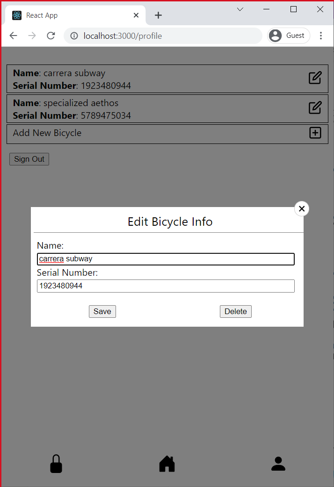

# Webpage
This is the webpage app for Imperial College's Embedded System CW1. 

## Usage
Node.js is required to be installed for running the script. (https://nodejs.org/en/download/). Dependencies of the script can installed by `npm install` <br>

Running the script: <br>
```
npm start
```
A webpage would be hosted on `http://localhost:3000/`. This is currently still in development mode. In the final product, separately starting up of the React dev Server would not be needed. 

## Features 

### Map / Home Page
The webpage would show a map of the surrounding of the user's location with markers on bicycle lock clusters. A green pin indicates availability while a red pin indicates that all locks are used. <br/>

<br/>
Upon clicking onto the pin, details about the lock would be shown, including name, total locks and available locks. Positions of the locks/pins are fetched upon loading the webpage.  <br/>

<br/>
Clicking on the "Check In" button would direct user to the Check In page with pre-filled Postcode and CLuster ID. <br/>

<br/>

### Check In / Check Out Page
The check in page has 3 text boxes for user to fill in the Serial Key number (Postcode-Cluster ID-ID) and a button to submit check in request. Upon checking in, information on the Lock Serial Key will be send across HTTP to the server on `http://localhost:5000/checkin` <br/>
 <br/>

User have to check out the bicycle on the webpage before removing the bike, by the red "Check Out" button. <br/>
 <br/>

The state of whether the user has checked into a lock is fetched on load of the page.

<br/>

### Profile Page
The profile page shows the bike users have declared including bike name and serial number. <br/>
 <br/>

It allows user to edit, add and delete bike entries. <br/>
 <br/>

### Prompt Login Page
When user trying to access to the Check In and Profile Page without login, they would be prompted to login. Clicking onto the "Sign In" button would direct user to the Login Page. <br/>
 <br/>

### Login Page
Allow user to login into their account. <br/>
 <br/>
Upon login, credentials will be sent to the server via HTTP for check. Upon successful login, username would be stored in the session. User will then be redirected to the page before being prompted to login.
<br/>

### Register Page
Allow users to register into the system by filling in information such as full name, username, email address and password. <br/>

<br/>

### Menu Bar
The footer is a menu bar that allows user to jump to different page. The lock icon refers to the Check In Page, the home icon refers to the home page and the person icon refers to the register page.

## TODO
1. Lock database
   - fetch average time per cluster
2. Password encryption
3. Add analytics
4. Report Stolen


## Change Log
27-Jan-2022 : initial commit <br/>
08-Feb-2022 : added map page <br/>
12-Feb-2022 : added check in out + register page. added router. <br/>
17-Feb-2022 : added HTTP communication with server on check in out page. <br/>
22-Feb-2022 : updated state machine + added login page with simple login authentication + query string in checkin page + bike serial number. <br/>
22-Feb-2022 : added checkin comfirmation + state machine done with the server. <br/>
24-Feb-2022 : added profile page with bike infos + fetching availability of lock clusters. <br/>