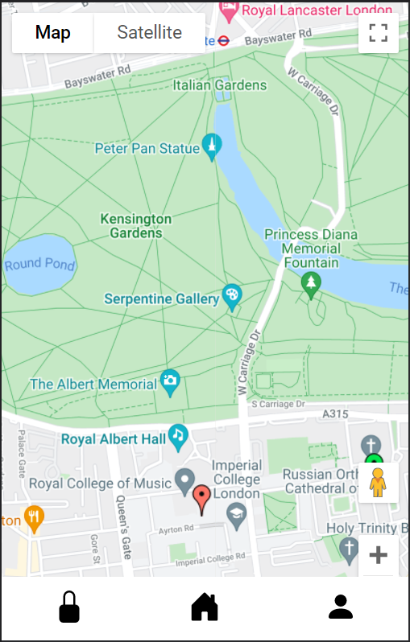

# Webpage
This is the webpage app for Imperial College's Embedded System CW1. 

## Usage
Node.js is required to be installed for running the script. (https://nodejs.org/en/download/). Dependencies of the script can installed by `npm install` <br>

Running the script: <br>
```
npm start
```
A webpage would be hosted on `http://localhost:3000/`. This is currently still in development mode. In the final product, separately starting up of the React dev Server would not be needed. 

## Map
The webpage would shows a map of the surrounding of the user's location with markers on bicycle lock clusters. A green pin indicates availability while a red pin indicates that all locks are used. <br/>

<br/>
Upon clicking onto the pin, details about the lock would be shown, including name, total locks and available locks. <br/>

<br/>

## Change Log
27-Jan-2022 : initial commit <br/>
08-Feb-2022 : added map page